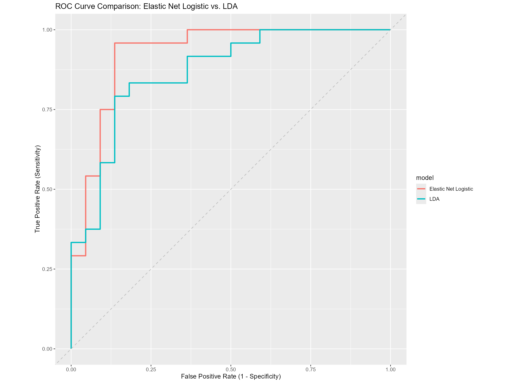

# WorldCupClassification

# Problem Statement and Project Context
This project aimed to understand what factors make up an "advancing team" profile, with the goal of gaining insight into Belgium vs. USA on 7/6/2026 (Round of 16). I implemented a soft classification approach using Logistic Regression (elastic net) and Linear Discriminant Analysis to infer common statistical patterns among teams that have advanced past the group stage, then applied those models to Belgium's and USA's own profiles for comparison.

**Target Variable:** `Advanced`, a binary variable with levels `"Advanced"` / `"Eliminated"`. A team is labeled "Advanced" if it played more than 3 matches (i.e., survived the group stage into the Round of 32).

**Predictors:** `possession`, `goals_per90`, `assists_per90`, `shots_on_target_pct`, `goals_per90_against`, `tackles_won_per90`, `interceptions_per90`, `gk_save_pct`, `cards_yellow_per90`, `cards_red_per90`, `fouls_per90`

All rate-based predictors were converted to per-90-minute values (rather than raw match totals) to avoid leakage — since advancing teams have by definition played more matches, raw cumulative counts like total fouls or total tackles would mechanically be larger for advancing teams regardless of actual playing style.

**Train split:** Predictors and target for all countries except Belgium & USA (n = 46)
**Application set:** Predictors for Belgium & USA only (not used in training; scored by the fitted models)

**Methods used and stack:** Logistic Regression (elastic net / lasso), Linear Discriminant Analysis, Cross-Validation, Model Tuning, R (tidymodels)

# Takeaways: Model Comparison via 5-fold Cross-Validation

|model                | mean_accuracy| mean_roc_auc| std_err_accuracy| std_err_roc_auc|
|:--------------------|-------------:|------------:|----------------:|---------------:|
|Elastic Net Logistic |     0.7294444|        0.791|        0.0718559|       0.0826499|
|LDA                  |     0.6400000|        0.650|        0.0889305|       0.1042113|

Both models perform meaningfully better than chance (0.50 AUC), but with high standard errors — a direct consequence of the small sample size feeding the 5-fold cross-validation. With n = 46 teams split into 5 folds, each fold's held-out (test) set contains only about 9 teams. With so few observations per fold, a single team's prediction can have an outsized influence on that fold's computed AUC, causing meaningful fold-to-fold variability, which is what produces the high standard error for both models.

Elastic Net Logistic Regression outperforms LDA on both accuracy and ROC AUC. This is likely because the elastic net (lasso) penalty performs automatic feature selection, dropping predictors that add more noise than signal given the limited sample size — as seen below, only 2 of 11 predictors survived. LDA has no equivalent built-in feature selection and uses all 11 predictors regardless of their individual reliability, making it more exposed to overfitting on weak or noisy features at this sample size.

# ROC Curve

The ROC curve describes the relationship between a model's True Positive Rate and False Positive Rate — a model that hugs the top-left corner has high true-positve rate and low false-positive rate. Elastic Net Logistic Regression traces a curve closer to the top-left than LDA, consistent with its higher CV AUC, and is the model I rely on for the final interpretation below.

# What Drives the Model: Coefficients

|term                |  estimate|   penalty|
|:-------------------|---------:|---------:|
|assists_per90       | 0.5931575| 0.0885867|
|goals_per90         | 0.4738101| 0.0885867|
|(Intercept)         | 0.1400281| 0.0885867|
|possession          | 0.0000000| 0.0885867|
|shots_on_target_pct | 0.0000000| 0.0885867|
|goals_per90_against | 0.0000000| 0.0885867|
|tackles_won_per90   | 0.0000000| 0.0885867|
|interceptions_per90 | 0.0000000| 0.0885867|
|gk_save_pct         | 0.0000000| 0.0885867|
|cards_yellow_per90  | 0.0000000| 0.0885867|
|cards_red_per90     | 0.0000000| 0.0885867|
|fouls_per90         | 0.0000000| 0.0885867|

The lasso penalty selected via cross-validation (penalty ≈ 0.089) shrank 9 of the 11 candidate predictors to exactly zero, retaining only **assists_per90** and **goals_per90**. This means that, once leakage from raw match-count statistics was removed, attacking output per 90 minutes was the only signal strong and consistent enough across 46 teams to reliably distinguish advancing teams from eliminated ones — defensive stats, discipline, possession, and goalkeeping did not add reliable predictive value at this sample size.

# Model Performance on Belgium & USA

|model               |team          | .pred_Advanced| .pred_Eliminated|
|:-------------------|:-------------|--------------:|----------------:|
|Logistic Regression |Belgium       |      0.6512436|        0.3487564|
|Logistic Regression |United States |      0.6441139|        0.3558861|
|LDA                 |Belgium       |      0.8780026|        0.1219974|
|LDA                 |United States |      0.6702437|        0.3297563|

**Interpretation:** Using the Elastic Net Logistic Regression model — the more reliable of the two given its stronger cross-validated performance and built-in feature selection — Belgium and the United States score almost identically (65.1% vs. 64.4% match to an "advancing team" profile). This closeness is a direct consequence of the model retaining only `goals_per90` and `assists_per90` as predictors: Belgium's values (1.85 goals/90, 1.15 assists/90) and USA's values (2.00 goals/90, 1.00 assists/90) are very close to each other, leaving little for the model to differentiate on. LDA shows a larger gap favoring Belgium (87.8% vs. 67.0%), but this result should be treated with more caution, since LDA uses all 11 predictors — including several that showed little individual reliability — and had a substantially weaker cross-validated AUC (0.650 vs. 0.791).

**This model does not predict who will win Monday's match.** It was trained on whether a team's statistical profile resembles that of teams which historically advanced past the group stage — a label both Belgium and the United States already share — not on a head-to-head match outcome. What it offers instead is a relative comparison of how strongly each team's underlying attacking output resembles that of teams that continue advancing deeper into the tournament. Based on the more trustworthy of the two models, that comparison shows Belgium and USA as close to evenly matched on the metrics that carried real predictive signal, rather than one team holding a clear statistical edge.

**AI Disclaimer**

This README was written with assistance from AI